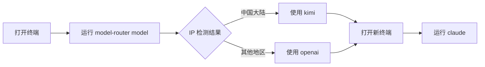

# 使用指南

## 安装

### 方式一：直接下载

1. 下载项目文件到本地目录（如 `D:\tools\model-router`）
2. 将该目录添加到系统 PATH 环境变量
3. 确保已安装 Python 3.6+

### 方式二：添加到 PATH

```powershell
# 临时添加（当前会话）
$env:PATH += ";D:\tools\model-router"

# 永久添加（用户级别）
[Environment]::SetEnvironmentVariable("PATH", $env:PATH + ";D:\tools\model-router", "User")
```

## 基本命令

### 命令格式

```
model-router <command> [options]
mr <command> [options]           # 简写形式
```

### 支持的命令

| 命令 | 说明 |
|------|------|
| `kimi` | 切换到 Kimi（Moonshot）模型 |
| `openai` | 切换到 OpenAI 模型（启动代理） |
| `model` | 自动检测 IP 并选择模型 |
| `claude` | 显示配置并启动 Claude CLI |

### 参数别名

```
model-router kimi
model-router /model kimi        # 兼容旧语法
model-router -m kimi            # 短选项
```

## 使用场景

### 场景一：国内使用（推荐）

```bat
# 自动检测 IP 归属地并选择模型
model-router model

# 输出示例：
# 检测到 IP 归属中国大陆，默认使用 kimi。
# 已设置模型：kimi（系统环境变量）
# 更新后的配置详情：
#   MODEL_ROUTER_ACTIVE_MODEL=kimi
#   ANTHROPIC_BASE_URL=https://api.moonshot.cn/anthropic
#   ANTHROPIC_MODEL=kimi-k2.5
#   ...
```

### 场景二：使用 OpenAI API

```bat
# 切换到 OpenAI（会自动启动代理）
model-router openai

# 输出示例：
# 已重启转换代理：http://127.0.0.1:19000
# 已设置模型：openai（系统环境变量）
# 更新后的配置详情：
#   MODEL_ROUTER_ACTIVE_MODEL=openai
#   MODEL_ROUTER_PROXY_URL=http://127.0.0.1:19000
#   ANTHROPIC_BASE_URL=http://127.0.0.1:19000
#   ...
```

### 场景三：使用第三方 OpenAI 兼容服务

```bat
# 设置自定义上游地址
set MODEL_ROUTER_OPENAI_BASE_URL=https://api.openrouter.ai/api/v1

# 然后切换到 openai 模式
model-router openai
```

### 场景四：快速启动 Claude CLI

```bat
# 配置环境并启动 Claude
model-router claude

# 也可以带参数
model-router claude --help
model-router claude /path/to/project
```

## 使用流程

### 首次使用



### 日常切换

```bat
# 在 Kimi 和 OpenAI 之间切换
model-router kimi    # 切换到 Kimi
model-router openai  # 切换到 OpenAI

# 每次切换后建议打开新终端
```

## 注意事项

### 环境变量生效

- **当前终端**：环境变量立即生效
- **新终端**：需要重新打开终端窗口
- **IDE/编辑器**：可能需要重启才能读取新环境变量

### 管理员权限

| 权限 | 效果 |
|------|------|
| 管理员 | 写入系统环境变量，所有程序可见 |
| 普通用户 | 仅写入用户环境变量，部分程序可能不识别 |

以管理员身份运行：

```powershell
# PowerShell
Start-Process powershell -Verb RunAs -ArgumentList "model-router kimi"

# CMD
runas /user:Administrator "model-router kimi"
```

### 代理服务器

- OpenAI 模式会自动启动本地代理
- 代理监听 `127.0.0.1:19000`（可配置）
- 切换模型时会自动重启代理
- 手动停止代理：任务管理器结束 `python.exe`（命令行含 `model-router-proxy.py`）

## 验证安装

```bat
# 检查命令是否可用
model-router --help

# 检查当前配置
model-router claude

# 检查代理状态（OpenAI 模式）
curl http://127.0.0.1:19000/health
```

## 常见问题

### Q: 提示 "写入系统环境变量失败"

**原因**：没有管理员权限

**解决**：
- 以管理员身份运行终端
- 或接受仅当前进程生效（打开新终端会失效）

### Q: 切换后 Claude Code 仍使用旧配置

**原因**：环境变量未在新终端生效

**解决**：
1. 完全关闭当前终端
2. 打开新终端窗口
3. 重新运行 `model-router claude`

### Q: OpenAI 模式连接超时

**原因**：
- 代理未启动
- 网络连接问题
- IP 被限制

**解决**：
```bat
# 检查代理是否运行
curl http://127.0.0.1:19000/health

# 手动重启代理
model-router openai
```

## 相关源码文件

- `model-router.py:536-562` - 参数解析
- `model-router.py:676-714` - 主流程
- `model-router.cmd` - Windows 入口
