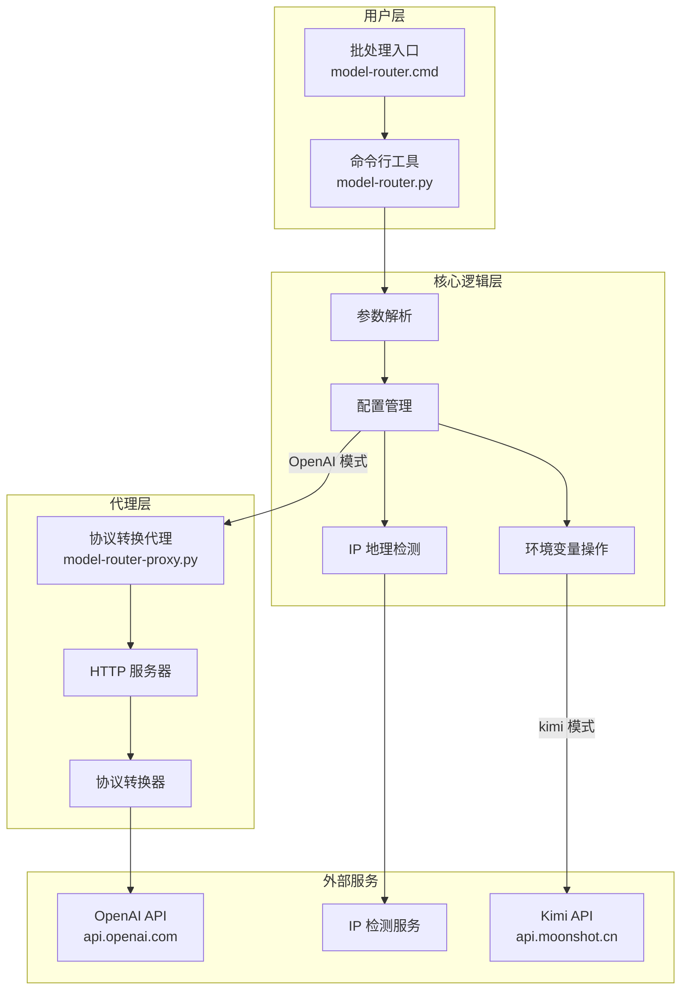
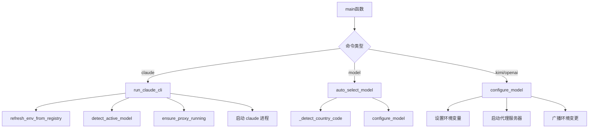
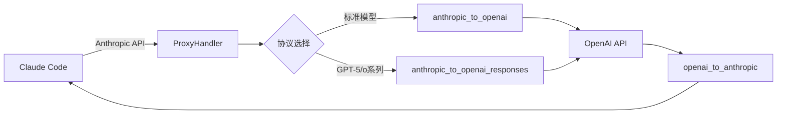

# 架构设计

## 系统架构图



## 组件关系

### 主程序（model-router.py）



### 代理服务器（model-router-proxy.py）



## 数据流

### 模型切换流程

```
用户输入命令
    ↓
解析参数 (parse_args)
    ↓
检测/选择模型
    ↓
配置环境变量 (configure_model)
    ├─ 如果是 openai 模式
    │   └─ 启动代理服务器 (ensure_proxy_running)
    │       ├─ 检查现有代理
    │       ├─ 终止旧进程
    │       └─ 启动新进程
    ├─ 写入注册表 (set_env_system/set_env_user)
    └─ 广播环境变更 (_broadcast_env_change)
    ↓
输出配置详情
```

### API 请求转换流程

```
Claude Code 请求
    ↓
Anthropic /v1/messages 格式
    ↓
ProxyHandler.do_POST
    ├─ 提取 API Key
    ├─ 判断是否使用 Responses API (_should_use_responses)
    └─ 转换请求格式
        ├─ anthropic_to_openai → /v1/chat/completions
        └─ anthropic_to_openai_responses → /v1/responses
    ↓
转发到上游 OpenAI 服务
    ↓
转换响应格式
    ├─ openai_to_anthropic
    └─ openai_responses_to_anthropic
    ↓
返回给 Claude Code
```

## 关键技术决策

### 1. 环境变量管理

- **系统级变量**：优先写入 `HKEY_LOCAL_MACHINE\SYSTEM\CurrentControlSet\Control\Session Manager\Environment`
- **用户级回退**：无管理员权限时写入 `HKEY_CURRENT_USER\Environment`
- **即时生效**：使用 `SendMessageTimeoutW` 广播 `WM_SETTINGCHANGE` 消息

### 2. 代理服务器设计

- **独立进程**：代理作为独立 Python 进程运行，避免阻塞主程序
- **端口复用**：支持端口递增（19000-19005），避免端口冲突
- **健康检查**：提供 `/health` 端点用于状态监控
- **版本兼容**：通过 `capabilities` 字段标识支持的特性

### 3. 协议转换策略

| Anthropic 概念 | OpenAI 映射 | 说明 |
|----------------|-------------|------|
| messages | messages | 角色和内容转换 |
| system | system 或 instructions | 根据 API 类型选择 |
| tools | tools | 工具定义格式转换 |
| tool_use | tool_calls | 工具调用转换 |
| tool_result | tool role | 工具结果转换 |
| stream | stream | SSE 流式响应 |

## 相关源码文件

- `model-router.py:58-70` - 环境变更广播实现
- `model-router.py:73-101` - 注册表操作函数
- `model-router.py:400-443` - 代理服务器生命周期管理
- `model-router-proxy.py:629-745` - HTTP 请求处理器
- `model-router-proxy.py:282-333` - 请求格式转换
- `model-router-proxy.py:367-439` - 响应格式转换
