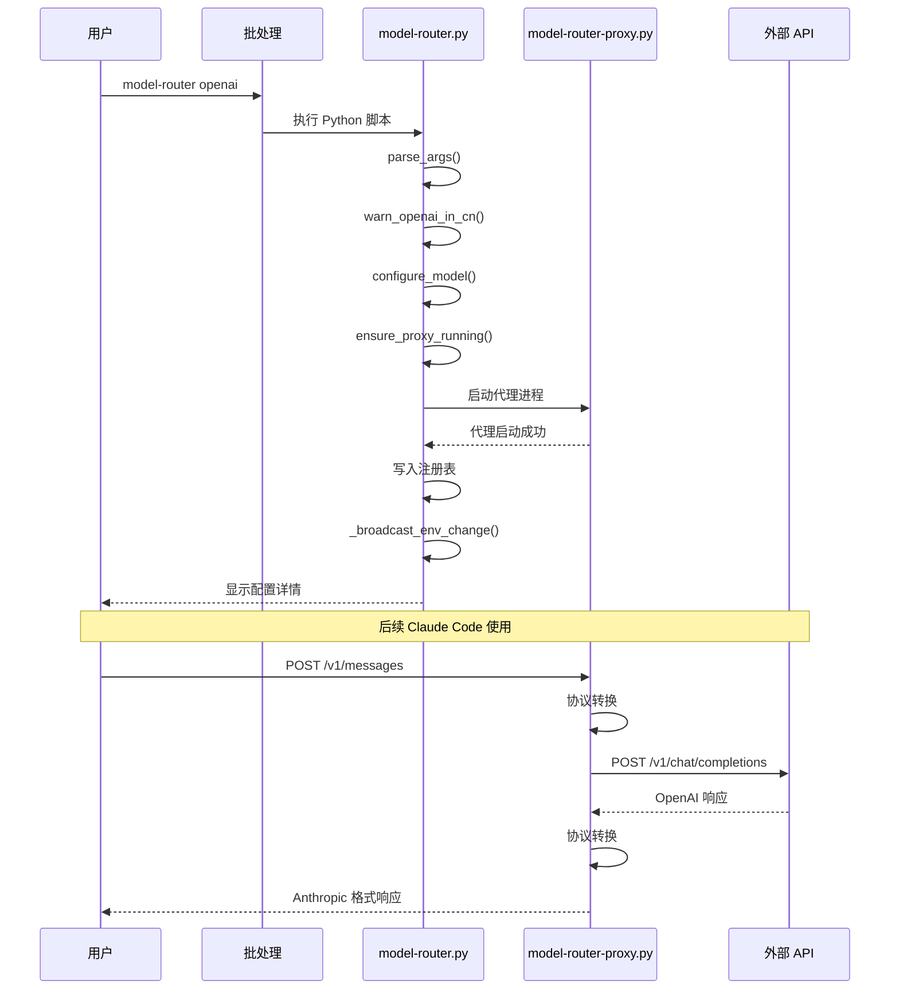

# 核心组件

## 文件结构

```
model-router/
├── model-router.py          # 主程序（715 行）
├── model-router-proxy.py    # 代理服务器（909 行）
├── model-router.cmd         # Windows 批处理入口
├── mr.cmd                   # 简写别名入口
├── README.md                # 英文说明文档
├── README_CN.md             # 中文说明文档
└── wiki_docs/               # 项目文档目录
```

## 主程序（model-router.py）

### 模块导入

```python
import argparse      # 命令行参数解析
import ctypes        # Windows API 调用
import json          # JSON 处理
import os            # 环境变量操作
import signal        # 进程信号处理
import subprocess    # 子进程管理
import sys           # 系统相关
import time          # 时间延迟
import urllib.*      # HTTP 请求
import winreg        # Windows 注册表操作
```

### 核心常量

| 常量 | 值 | 说明 |
|------|-----|------|
| DEFAULT_OPENAI_BASE_URL | `https://api.openai.com/v1` | OpenAI 默认端点 |
| DEFAULT_PROXY_URL | `http://127.0.0.1:19000` | 代理默认地址 |
| DEFAULT_OPENAI_CHAT_MODEL | `gpt-5.2-codex` | 默认聊天模型 |
| SYSTEM_ENV_SUBKEY | `SYSTEM\CurrentControlSet\Control\Session Manager\Environment` | 系统环境变量键 |
| USER_ENV_SUBKEY | `Environment` | 用户环境变量键 |

### 模型配置（ENV_BY_MODEL）

```python
ENV_BY_MODEL = {
    "kimi": {
        "ANTHROPIC_BASE_URL": "https://api.moonshot.cn/anthropic",
        "ANTHROPIC_AUTH_TOKEN": "sk-...",
        "ANTHROPIC_MODEL": "kimi-k2.5",
        # ... 其他配置
    },
    "openai": {
        "ANTHROPIC_BASE_URL": DEFAULT_PROXY_URL,
        "ANTHROPIC_AUTH_TOKEN": "sk-...",
        "ANTHROPIC_MODEL": "gpt-5.2-codex",
        # ... 其他配置
    },
}
```

### 主要函数

#### 环境变量管理

| 函数 | 行号 | 功能 |
|------|------|------|
| `_broadcast_env_change` | 58-70 | 广播环境变量变更通知 |
| `set_env_system` | 78-83 | 设置系统环境变量 |
| `set_env_user` | 86-88 | 设置用户环境变量 |
| `delete_env_user` | 90-101 | 删除用户环境变量 |
| `refresh_env_from_registry` | 503-509 | 从注册表刷新环境变量 |

#### 代理服务器管理

| 函数 | 行号 | 功能 |
|------|------|------|
| `_check_proxy_health` | 145-159 | 检查代理健康状态 |
| `_is_proxy_compatible` | 162-170 | 检查代理版本兼容性 |
| `_list_proxy_processes` | 208-261 | 列出代理进程 |
| `_terminate_proxy_processes` | 302-337 | 终止代理进程 |
| `_start_proxy_process` | 340-385 | 启动代理进程 |
| `ensure_proxy_running` | 400-443 | 确保代理运行 |

#### IP 地理检测

| 函数 | 行号 | 功能 |
|------|------|------|
| `_extract_country_code` | 596-615 | 从响应提取国家代码 |
| `_fetch_geo_json` | 618-628 | 获取 IP 地理信息 |
| `_detect_country_code` | 631-642 | 检测国家代码 |
| `auto_select_model` | 645-651 | 自动选择模型 |
| `warn_openai_in_cn` | 654-673 | 在中国大陆警告 |

#### 主流程控制

| 函数 | 行号 | 功能 |
|------|------|------|
| `parse_args` | 536-562 | 解析命令行参数 |
| `configure_model` | 446-477 | 配置模型环境 |
| `run_claude_cli` | 565-593 | 运行 Claude CLI |
| `main` | 676-714 | 主入口函数 |

## 代理服务器（model-router-proxy.py）

### 模块导入

```python
import argparse              # 命令行参数
import json                  # JSON 处理
import os                    # 环境变量
import sys                   # 系统相关
import uuid                  # UUID 生成
import urllib.*              # HTTP 请求
from http.server import ...  # HTTP 服务器
```

### 核心常量

| 常量 | 值 | 说明 |
|------|-----|------|
| DEFAULT_UPSTREAM_BASE | `https://api.openai.com/v1` | 上游默认地址 |
| DEFAULT_USER_AGENT | `model-router-proxy/1.0` | 请求 User-Agent |
| PROXY_VERSION | `1.1` | 代理版本 |

### 协议转换函数

#### Anthropic → OpenAI

| 函数 | 行号 | 功能 |
|------|------|------|
| `_coerce_text` | 87-106 | 统一内容格式 |
| `_map_tools` | 109-123 | 转换工具定义（Chat） |
| `_map_tools_responses` | 126-143 | 转换工具定义（Responses） |
| `_map_tool_choice` | 146-156 | 转换工具选择（Chat） |
| `_map_tool_choice_responses` | 159-169 | 转换工具选择（Responses） |
| `_convert_anthropic_message` | 246-279 | 转换单条消息（Chat） |
| `_convert_anthropic_message_to_responses_items` | 195-243 | 转换消息（Responses） |
| `anthropic_to_openai` | 282-306 | 完整请求转换（Chat） |
| `anthropic_to_openai_responses` | 309-333 | 完整请求转换（Responses） |

#### OpenAI → Anthropic

| 函数 | 行号 | 功能 |
|------|------|------|
| `_openai_message_to_blocks` | 336-356 | 消息转内容块 |
| `_map_finish_reason` | 359-364 | 映射结束原因 |
| `openai_to_anthropic` | 367-386 | 响应转换（Chat） |
| `openai_responses_to_anthropic` | 389-439 | 响应转换（Responses） |

### 流式处理类（AnthropicStreamWriter）

```python
class AnthropicStreamWriter:
    def __init__(self, handler, requested_model)
    def _write_event(self, event, data)          # 写入 SSE 事件
    def _start_message(self, message_id, model)  # 开始消息
    def _start_text_block(self)                  # 开始文本块
    def _start_tool_block(self, ...)             # 开始工具块
    def handle_text_delta(self, text)            # 处理文本增量
    def handle_tool_delta(self, tool_call)       # 处理工具增量
    def finalize_pending_tools(self)             # 完成待处理工具
    def finish(self)                             # 完成消息
```

### HTTP 处理器（ProxyHandler）

```python
class ProxyHandler(BaseHTTPRequestHandler):
    protocol_version = "HTTP/1.1"

    def _send_json(self, status, payload)        # 发送 JSON 响应
    def _send_text(self, status, text)           # 发送文本响应
    def _read_body(self)                         # 读取请求体
    def do_GET(self)                             # 处理 GET 请求
    def do_POST(self)                            # 处理 POST 请求
    def _handle_stream(self, response, ...)      # 处理 Chat 流式响应
    def _handle_responses_stream(self, ...)      # 处理 Responses 流式响应
```

### 端点说明

| 端点 | 方法 | 功能 |
|------|------|------|
| `/health` | GET | 健康检查，返回状态和版本 |
| `/v1/messages` | POST | 代理 Anthropic 消息请求 |

### 响应 API 选择逻辑

```python
def _should_use_responses(model):
    # GPT-5 系列 → Responses API
    # o 系列 → Responses API
    # codex 模型 → Responses API
    # 可通过环境变量强制启用
```

## 批处理入口

### model-router.cmd / mr.cmd

```batch
@echo off
setlocal
python "%~dp0model-router.py" %*
```

- `%~dp0` - 获取批处理文件所在目录
- `%*` - 传递所有命令行参数

## 组件交互图



## 相关源码文件

- `model-router.py` - 主程序完整实现
- `model-router-proxy.py` - 代理服务器完整实现
- `model-router.cmd` - Windows 入口脚本
